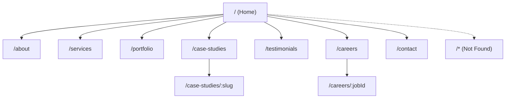

# Feature Requirements Document (FRD) — Multi-page Company Website

## 1. Scope
This FRD defines the features and requirements for converting the existing single-page React site into a multi-page, IT industry–focused website. The final product will provide dedicated pages (Home, About, Services, Portfolio, Case Studies, Testimonials, Careers, Contact, and 404), a shared layout with consistent navigation, responsive behavior across common breakpoints, accessibility conforming to WCAG 2.1 AA, and SEO fundamentals. The site will use sample content only and will not integrate with any third-party services or analytics in this phase.

In scope:
- Client-side routing with React Router.
- Dedicated pages with sample content templates.
- Responsive, accessible UI with modern, neutral theming appropriate for IT.
- Basic SEO (unique titles/meta; Open Graph; static sitemap/robots stubs).
- Analytics placeholders only (disabled/inactive).

Out of scope for this release:
- External service integrations (e.g., CMS, CRM, analytics telemetry, form backends).
- Server-side rendering (SSR) or static generation (SSG).
- Internationalization (i18n) and localization (l10n).
- Authentication/authorization and user accounts.

## 2. Goals and Success Metrics
Goals:
- Enable deep linking to dedicated pages for improved discoverability and navigation.
- Provide an IT-focused content structure that supports services, case studies, and careers.
- Deliver a responsive, accessible, and performant experience.

Success metrics:
- Lighthouse Performance ≥ 85 and Accessibility ≥ 90 on Home, Services, Portfolio, and Careers.
- Zero broken internal links and a functional 404 page.
- Visual and functional responsiveness at 320, 480, 768, 1024, and 1280+ widths.
- All pages provide unique titles and meta descriptions.

## 3. Target Personas
- IT Decision Maker (CIO/CTO/VP Engineering): Researches vendor capabilities and credibility; prioritizes performance, security, and delivery track record.
- Engineering Manager/Tech Lead: Evaluates technical depth, case studies, and project outcomes; values developer experience and clarity.
- Candidate (Mid/Senior Engineer in IT): Reviews open roles, culture highlights, and application flow; expects clarity, inclusivity, and mobile-friendliness.
- Startup Founder in IT/Tech: Scans services, differentiators, and contact options; needs concise messaging and fast navigation.

## 4. Sitemap and Information Architecture
Primary routes:
- Home: /
- About: /about
- Services: /services
- Portfolio: /portfolio
- Case Studies (list): /case-studies
- Case Study detail: /case-studies/:slug
- Testimonials: /testimonials
- Careers (list): /careers
- Career detail: /careers/:jobId
- Contact: /contact
- 404 (Not Found): /*



Navigation:
- Global top navigation includes: Home, About, Services, Portfolio, Case Studies, Testimonials, Careers, Contact.
- Footer repeats key links and includes basic company information.

## 5. Functional Requirements
### 5.1 Global
- Routing: Client-side routing implemented with React Router; no full page reloads for internal links.
- Layout: Shared MainLayout with header, navigation, skip-to-content link, main content region, and footer.
- Active Link States: Current route is visually indicated and accessible via aria-current or NavLink semantics.
- Error Handling: 404 Not Found route for unmatched paths.
- SEO Tags: Each page sets a unique title and meta description at runtime; key pages include Open Graph tags.

### 5.2 Home (/)
- Hero section with a headline, supporting text, and a primary call-to-action linking to Contact or Services.
- Overview tiles or short summaries for IT Services, Portfolio highlights, and Careers teaser.
- Decorative elements should remain performant and accessible.

### 5.3 About (/about)
- Company mission, values, and high-level stats.
- Content reuses/refactors existing About section.

### 5.4 Services (/services)
- Grid of IT-focused service offerings using a structured array (icon, title, description).
- Optional sub-sections for methodology or engagement models (textual content only).

### 5.5 Portfolio (/portfolio)
- Grid of featured projects with title, category, and short description.
- Semantic article elements for each project; images can be emoji or placeholder graphics.

### 5.6 Case Studies (/case-studies, /case-studies/:slug)
- List page with sample case study cards (title, summary, industry).
- Detail page by slug with structured sections: Problem, Solution, Outcomes, and Tech Stack (sample content).

### 5.7 Testimonials (/testimonials)
- Testimonials list with name, role, content, and rating (stars).
- Accessible star ratings and semantic attribution.

### 5.8 Careers (/careers, /careers/:jobId)
- List page with sample job postings (title, type, location, summary).
- Detail page with role description, responsibilities, requirements, and an “Apply” CTA placeholder (no submission).

### 5.9 Contact (/contact)
- Client-side validated contact form with Name, Email, and Message.
- Local-only submission flow; show in-page success message; no external API calls.

## 6. Non-Functional Requirements
- Performance:
  - Route-based code splitting using React.lazy and Suspense.
  - Minimize bundle size; avoid heavy libraries and unnecessary reflows.
  - Lighthouse Performance score ≥ 85 on key pages.
- Accessibility (WCAG 2.1 AA):
  - Keyboard navigable with visible focus indicators.
  - Proper semantics (header, nav, main, footer, h1–h3 hierarchy).
  - Color contrast meets AA guidelines.
  - Form fields include labels, descriptions, and error feedback.
- Responsiveness:
  - Support 320, 480, 768, 1024, 1280+ breakpoints.
  - Adaptive grid layouts and scalable typography (clamp()).
- SEO:
  - Unique per-page title and meta description.
  - Open Graph tags on Home, Services, Portfolio, and Careers.
  - Static robots.txt and sitemap.xml placeholders for deployment.
- Maintainability:
  - Centralized route configuration and shared layout components.
  - Content defined in local arrays/objects for consistency and reuse.
- Privacy/Security:
  - No external tracking; no PII persistence beyond client memory.
  - Avoid dangerous inline scripts; follow best practices for DOM updates.

## 7. Acceptance Criteria per Feature/Page
Global
- All internal links use React Router; no full reloads.
- 404 page renders for unknown paths.
- Skip-to-content link focuses target main region.
- Active navigation links expose aria-current and visible styling.

Home
- Hero renders headline, supporting copy, and CTA; CTA navigates correctly.
- Overview sections link to Services, Portfolio, and Careers without broken links.

About
- Displays mission statement and stats; headings follow a logical hierarchy.
- Content is readable at all breakpoints.

Services
- Renders services grid from a data array; at least six services display on larger screens.
- Cards remain accessible: each has a heading, descriptive text, and clear hit areas.

Portfolio
- Renders a responsive grid of project cards; cards are articles with headings.
- Cards are keyboard-focusable and have hover/focus states.

Case Studies
- List page shows at least one case study card with summary and “Read more”.
- Detail page resolves by slug and includes Problem, Solution, Outcomes sections.

Testimonials
- Shows at least three testimonials; star ratings announce correct rating via aria or label.
- Content is legible on small screens.

Careers
- List page displays at least one role with title, type, and location.
- Detail page resolves by jobId and includes responsibilities and requirements.
- “Apply” button is present but does not submit to third parties.

Contact
- Form validates fields client-side and shows success message on submit.
- No network requests are made to external APIs.

Non-functional
- Responsive across 320, 480, 768, 1024, 1280+ widths.
- Lighthouse Performance ≥ 85; Accessibility ≥ 90 on key pages.
- Unique titles and meta descriptions per route; OG tags on key pages.

## 8. UX/UI Requirements
- Layout:
  - Sticky topbar with brand and primary navigation; Footer with company info and links.
  - Clear content hierarchy using H1 for page title and H2/H3 for sections.
- Visual design:
  - Neutral modern theme suitable for IT; consistent spacing and color tokens.
  - Interactive elements have hover and focus-visible styles with adequate contrast.
- Components:
  - Buttons (primary/secondary), cards (services, portfolio, case studies), lists (jobs), and form inputs.
  - Skip-to-content visible on focus; keyboard focus order matches DOM order.
- Typography:
  - Responsive type scale via clamp(); adequate line-height for readability.
- Microinteractions:
  - Subtle transitions; avoid motion that can cause distraction or reduce performance.
- Forms:
  - Labels connected via htmlFor; error messages positioned adjacent to inputs; clear instructions.

## 9. Accessibility Requirements
- Landmarks: header, nav, main, footer used appropriately.
- Headings: Single H1 per page; hierarchical structure is preserved.
- Focus: Use :focus-visible outlines with sufficient contrast and width.
- Contrast: Text and interface elements meet AA contrast ratios.
- Semantics: Use role and aria-labels where needed; avoid redundant aria attributes.
- Forms: Inputs are labeled, error messages announce context, and validation messages are clear.

## 10. SEO Requirements
- Titles: Each route sets a unique, descriptive title.
- Meta descriptions: Each page defines a concise description (≤ 160 chars where possible).
- Open Graph: Include og:title, og:description, and og:type for key routes.
- URLs: Human-readable slug for case studies; numeric/slug id for careers roles.
- Crawlability: Provide robots.txt and sitemap.xml placeholders.

## 11. Performance Requirements
- Code splitting: Lazy-load all page routes.
- Asset optimization: Use emoji/SVG/placeholders; defer heavy assets.
- CSS: Prefer a single main stylesheet; avoid blocking resources where possible.
- Metrics: Lighthouse Performance ≥ 85 on Home, Services, Portfolio, Careers.

## 12. Content Requirements (Sample Content)
All content will be sample/mock and locally stored.

Sample data shapes (illustrative):
```json
{
  "services": [
    { "icon": "💻", "title": "Web Development", "description": "Modern, performant web apps for IT." },
    { "icon": "☁️", "title": "Cloud & DevOps", "description": "Scalable infrastructure and CI/CD." },
    { "icon": "🔒", "title": "Security", "description": "Secure-by-design apps and audits." },
    { "icon": "📱", "title": "Mobile", "description": "Cross-platform apps and PWAs." },
    { "icon": "📊", "title": "Data & AI", "description": "Analytics dashboards and ML integrations." }
  ],
  "portfolio": [
    { "title": "E-Commerce Platform", "category": "Web", "image": "🛍️", "description": "Real-time inventory and checkout." },
    { "title": "Healthcare Portal", "category": "Web", "image": "🏥", "description": "Telemedicine and patient management." }
  ],
  "caseStudies": [
    {
      "slug": "banking-portal-modernization",
      "title": "Banking Portal Modernization",
      "summary": "Reduced latency by 40% via microfrontends.",
      "industry": "IT/Fintech",
      "problems": ["Legacy monolith", "Slow release cycles"],
      "solutions": ["Microfrontend architecture", "Automated CI/CD"],
      "outcomes": ["40% faster page loads", "Weekly deployments"]
    }
  ],
  "testimonials": [
    { "name": "Sarah Johnson", "role": "CEO, TechStart", "content": "Transformed our digital presence.", "rating": 5 },
    { "name": "Michael Chen", "role": "CTO, Innovation Labs", "content": "Outstanding skills and delivery.", "rating": 5 }
  ],
  "jobs": [
    {
      "id": "fe-001",
      "title": "Senior Frontend Engineer",
      "location": "Remote",
      "type": "Full-time",
      "summary": "Build performant React apps for IT clients.",
      "requirements": ["5+ years React", "Accessibility and testing fundamentals"],
      "responsibilities": ["Own features end-to-end", "Collaborate with designers"]
    }
  ]
}
```

## 13. Analytics Placeholders (Not Enabled)
- Include a commented code placeholder for future analytics initialization (e.g., GA or Plausible) without loading any external scripts or sending data.
- Document where analytics would be initialized (e.g., in main entry after router setup) and events to consider (page views on route change). Keep disabled by default.

## 14. Constraints and Assumptions
- Framework: Vite + React; client-side routing via React Router.
- No third-party integrations or external APIs in this phase.
- Branding: Neutral, modern theme; no specific brand assets provided.
- Hosting: Deployed as a static front-end; sitemap/robots provided as placeholders.
- Content: Populated entirely with sample/mock data.

## 15. Out-of-Scope
- Backend services, databases, or server APIs.
- Real analytics tracking or tag management.
- Payment processing, authentication, or user accounts.
- Advanced SEO (schema.org, breadcrumbs, canonical URLs) beyond basic tags.
- Multi-language support.

## 16. Responsive Behavior and Breakpoints
- Breakpoints: 320, 480, 768, 1024, 1280+ (min-width–based).
- Behavior:
  - Navigation collapses/hides on narrow widths; ensure access to all pages via alternatives or a simplified menu.
  - Grids for services, portfolio, and case studies adapt to one column on small screens; multi-column as width increases.
  - Typography scales with clamp(); ensure comfortable line lengths and spacing.
  - Touch targets meet recommended sizes (≥ 44px).

## 17. Dependencies and Environment
- Dependencies: React Router (to be added); existing Vite React stack already present.
- Scripts: Keep existing npm scripts; no changes to environment variables required.
- No runtime configuration or secrets necessary.

## 18. Risks and Mitigations
- SEO limitations with client-side meta updates.
  - Mitigation: Provide clean routes and sitemap; consider SSR/SSG in future iterations.
- Accessibility regressions due to color/contrast or focus states.
  - Mitigation: Validate tokens and enforce visible focus rings; include an accessibility QA pass.
- Performance regressions from added routes/components.
  - Mitigation: Apply route-based code splitting; avoid heavy assets.

## 19. Definition of Done (DoD)
- All defined routes render with no broken links.
- Responsive layouts verified at all breakpoints.
- Accessibility features validated: landmarks, focus, labels, and AA contrast.
- Unique titles and meta descriptions per route; OG tags on key pages.
- Lighthouse targets met on Home, Services, Portfolio, and Careers.
- No external integrations; sample content only; analytics disabled.
