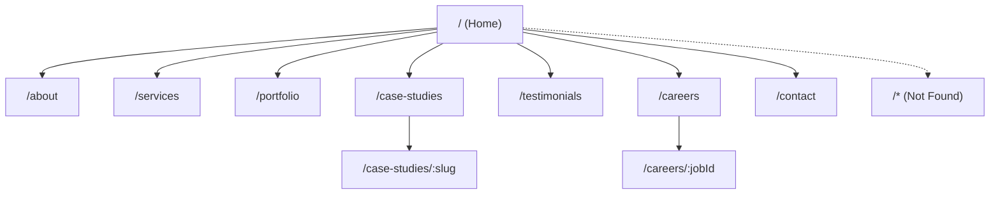

# Multi-page Website Implementation Plan

## Project Overview
This document defines the implementation plan to convert the existing single-page React site into a multi-page, fully responsive website using Vite + React with React Router. The project will introduce dedicated pages for key sections, including a new Careers page, while maintaining a modern, neutral theme suitable for an IT-focused company. The site will use sample content only and avoid third-party integrations. Accessibility, performance, and SEO will be first-class concerns across the entire build.

Current state:
- Vite + React scaffold is in place, rendering a single-page layout with sections for Hero, About, Services, Portfolio, Testimonials, and Contact.
- Styling uses a modern, responsive CSS file with theming tokens defined in the root.
- No routing is implemented yet; navigation relies on anchor links within one page.

Target state:
- Multi-page routing via React Router.
- Separate pages for Home, About, Services, Portfolio, Testimonials, Contact, Careers, and optionally Case Studies to support structured content templates as requested.
- Shared layout components and a single source of truth for navigation.
- Fully responsive, accessible UI meeting WCAG 2.1 AA color contrast guidelines and keyboard navigation requirements.
- SEO basics with unique titles, meta descriptions, and Open Graph tags per route, plus sitemap stub.

## Sitemap and Navigation
The website will be structured to support a standard B2B IT services company. All pages will be generated client-side via React Router without third-party services.

- Home: /
- About: /about
- Services: /services
- Portfolio: /portfolio
- Case Studies (sample content templates): /case-studies and /case-studies/:slug
- Testimonials: /testimonials
- Careers: /careers and /careers/:jobId
- Contact: /contact
- 404: /* (Not Found)

Primary navigation displayed in the topbar will include: Home, About, Services, Portfolio, Case Studies, Testimonials, Careers, Contact.

Sitemap diagram:


## Non-Functional Requirements (Performance, Accessibility, Responsiveness, SEO)
- Performance:
  - Use code-splitting per route with lazy loading to minimize initial bundle.
  - Lighthouse Performance score ≥ 85 on Home, Services, Portfolio, and Careers.
  - Optimize images (use emoji/svgs/placeholders only) and avoid heavy libraries.
- Accessibility:
  - Keyboard navigable: skip links, focus-visible styles, logical tab order, and no keyboard traps.
  - Semantics: use landmarks (header, nav, main, footer), headings in logical order, aria-labels where needed.
  - Color contrast: meet WCAG AA contrast ratios; test token palette against AA thresholds.
  - Lighthouse Accessibility score ≥ 90 on key pages.
- Responsiveness:
  - Support 320, 480, 768, 1024, and 1280+ breakpoints.
  - Ensure grid/list layouts adapt gracefully and typography scales with clamp().
- SEO:
  - Unique <title> and meta description per route.
  - Open Graph tags for key pages; structured data can be omitted or added later (no third-party).
  - robots.txt and sitemap.xml stubs for deployment; content generated locally as placeholders.

## Epics with User Stories and Acceptance Criteria

### Epic 1: Routing and Architecture
- User Story 1.1: As a visitor, I can navigate to dedicated pages via clean URLs (e.g., /services) so I can directly access specific information.
  - Acceptance Criteria:
    - React Router renders each page component at its path.
    - All primary nav links route without full page reloads.
    - 404 route renders a Not Found page.
- User Story 1.2: As a developer, I can manage routes in a single configuration for maintainability.
  - Acceptance Criteria:
    - Routes defined in a central file or co-located module with lazy imports.
    - Code-splitting creates separate route chunks.

### Epic 2: Layout and Navigation
- User Story 2.1: As a visitor, I see a consistent header, nav, and footer across all pages.
  - Acceptance Criteria:
    - MainLayout provides shared topbar and footer.
    - Active navigation link is visually indicated using accessible styles.
- User Story 2.2: As a keyboard user, I can quickly reach main content.
  - Acceptance Criteria:
    - A visible “Skip to content” link appears on focus and jumps to main.

### Epic 3: Page Implementations (Content First)
- User Story 3.1 (Home): As a visitor, I see a hero, brief overview, and CTAs on the home page.
  - Acceptance Criteria:
    - Content renders from simple data structures; all sections are responsive and accessible.
- User Story 3.2 (About): As a visitor, I learn about the company’s mission and stats.
  - Acceptance Criteria:
    - About page includes the existing content refactored into its own route and maintains responsive layout.
- User Story 3.3 (Services): As a buyer, I can scan IT service offerings and value props.
  - Acceptance Criteria:
    - Services use a structured array for title, icon, description.
- User Story 3.4 (Portfolio): As a prospect, I can review highlighted projects at a glance.
  - Acceptance Criteria:
    - Portfolio grid is responsive; cards are semantic articles.
- User Story 3.5 (Case Studies): As a prospect, I can deep-dive into selected IT projects.
  - Acceptance Criteria:
    - List page and detail page exist; detail resolves by slug; content uses sample markdown or structured data.
- User Story 3.6 (Testimonials): As a visitor, I can read authentic endorsements.
  - Acceptance Criteria:
    - Testimonials render with accessible star ratings and clear attribution.
- User Story 3.7 (Careers): As a candidate, I can browse roles and view a job detail page.
  - Acceptance Criteria:
    - Careers list and job detail routes exist with sample roles and job descriptions; responsiveness and a11y are met.
- User Story 3.8 (Contact): As a user, I can send a mock message.
  - Acceptance Criteria:
    - Existing contact form refactored into its own route; client-only validation; no external API calls.

### Epic 4: Accessibility and Responsiveness
- User Story 4.1: As a keyboard user, I can navigate all interactive elements.
  - Acceptance Criteria:
    - Focus styles are visible; tab order follows content order.
- User Story 4.2: As a low-vision user, I can read text comfortably.
  - Acceptance Criteria:
    - Contrast meets AA; headings and landmarks are semantic.

### Epic 5: SEO and Metadata
- User Story 5.1: As a content editor, I can set per-page title and meta description.
  - Acceptance Criteria:
    - Each route sets unique title and description programmatically without third-party libraries.
- User Story 5.2: As a marketer, our links look good on social.
  - Acceptance Criteria:
    - Open Graph meta tags present for key routes (Home, Services, Portfolio, Careers).

### Epic 6: Quality and Testing
- User Story 6.1: As a developer, I can verify routing and page rendering automatically.
  - Acceptance Criteria:
    - Basic route smoke tests exist for key pages (dev-only).
- User Story 6.2: As a team, we maintain performance and a11y standards.
  - Acceptance Criteria:
    - Lighthouse reports meet targets for Home, Services, Portfolio, Careers.

## Tasks and Subtasks (Sequencing and Ownership Placeholders)
The sequence is designed to minimize rework and ensure early validation of routing and layout.

```mermaid
graph LR
  A["1. Set up React Router (routes + lazy)"] --> B["2. Implement MainLayout (header/nav/footer + skip link)"]
  B --> C["3. Migrate existing sections to Pages (Home/About/Services/Portfolio/Testimonials/Contact)"]
  C --> D["4. Add Careers (list + detail) with sample content"]
  D --> E["5. Add Case Studies (list + detail) with sample content"]
  E --> F["6. Accessibility pass (landmarks, focus, labels, contrast)"]
  F --> G["7. SEO meta per route + sitemap/robots stubs"]
  G --> H["8. Responsive refinements at key breakpoints"]
  H --> I["9. QA: routing, a11y, perf (Lighthouse targets)"]
```



Detailed tasks:
1) Routing Foundations [Owner: FE]
- Add react-router-dom and configure BrowserRouter.
- Create src/layouts/MainLayout.jsx with header, nav (NavLink), main, footer.
- Replace anchor links with NavLink for SPA navigation.
- Add NotFound page and catch-all route.
- Lazy-load routes with React.lazy and Suspense.

2) Page Migration [Owner: FE]
- Home route: recompose Hero + top summaries from existing components.
- About route: move About.jsx content into dedicated page wrapper.
- Services route: map from services array (existing).
- Portfolio route: map from portfolio array (existing items).
- Testimonials route: map from testimonials array (existing).
- Contact route: move Contact.jsx form; retain current validation behavior.

3) New Pages: Careers and Case Studies [Owner: FE]
- Careers:
  - Create list page (/careers) reading from sample jobs array.
  - Create detail page (/careers/:jobId) resolving by id; include apply CTA placeholder (no external submit).
- Case Studies:
  - Create list page (/case-studies) reading from sample studies array.
  - Create detail page (/case-studies/:slug) resolving by slug; content uses sample copy.

4) Accessibility Enhancements [Owner: FE + QA]
- Add skip-to-content link in layout.
- Ensure headings are in order; add aria-labels where needed.
- Ensure focus-visible styles; verify tab order.
- Validate color contrast (update CSS tokens if needed).

5) SEO and Metadata [Owner: FE]
- Add a small utility setMeta({ title, description, og }) using document APIs.
- Set unique title/meta for each route in useEffect.
- Add placeholder robots.txt and sitemap.xml (static stubs in public/).

6) Responsiveness & Visual QA [Owner: FE + QA]
- Test at 320, 480, 768, 1024, 1280+.
- Adjust grids and spacing for narrow screens; verify typography scale.

7) Testing & Quality [Owner: QA]
- Add route smoke tests (dev-only).
- Run Lighthouse and capture scores; iterate to meet thresholds.

8) Documentation & Handover [Owner: FE]
- Update README with multi-page instructions and routes.
- Record any known limitations.

## Content Strategy (Sample Content Placeholders and Data Structures)
Use simple JS objects/arrays stored locally; no external services.

Sample shapes (illustrative):
```json
{
  "services": [
    { "icon": "💻", "title": "Web Development", "description": "Modern, performant web apps for IT." },
    { "icon": "☁️", "title": "Cloud & DevOps", "description": "Scalable infrastructure and CI/CD." },
    { "icon": "🔒", "title": "Security", "description": "Secure-by-design apps and audits." }
  ],
  "portfolio": [
    { "title": "E-Commerce Platform", "category": "Web", "image": "🛍️", "description": "Real-time inventory and checkout." }
  ],
  "testimonials": [
    { "name": "Sarah Johnson", "role": "CEO, TechStart", "content": "Transformed our digital presence.", "rating": 5 }
  ],
  "caseStudies": [
    {
      "slug": "banking-portal-modernization",
      "title": "Banking Portal Modernization",
      "summary": "Reduced latency by 40% via microfrontends.",
      "industry": "IT/Fintech",
      "problems": ["Legacy monolith", "Slow release cycles"],
      "solutions": ["Microfrontend architecture", "Automated CI/CD"],
      "outcomes": ["40% faster page loads", "Weekly deployments"]
    }
  ],
  "jobs": [
    {
      "id": "fe-001",
      "title": "Senior Frontend Engineer",
      "location": "Remote",
      "type": "Full-time",
      "summary": "Build performant React applications for IT clients.",
      "requirements": ["5+ years React", "Accessibility and testing fundamentals"],
      "responsibilities": ["Own features end-to-end", "Collaborate with designers"]
    }
  ]
}
```

Notes:
- Populate with IT-focused examples.
- Keep copy concise and scannable; use headings and lists for readability.

## Routing and Architecture Plan
- Dependencies:
  - React Router will be used for client-side routing.
- File structure (proposed):
  - src/layouts/MainLayout.jsx
  - src/pages/
    - Home.jsx, About.jsx, Services.jsx, Portfolio.jsx, Testimonials.jsx, Contact.jsx
    - Careers/
      - CareersList.jsx, CareerDetail.jsx
    - CaseStudies/
      - CaseStudiesList.jsx, CaseStudyDetail.jsx
  - src/routes.jsx (or src/router/index.jsx)
  - src/utils/seo.js (simple setMeta helper)
  - public/robots.txt, public/sitemap.xml (stubs)

- Route configuration (illustrative):
```jsx
// src/routes.jsx (illustrative)
import { lazy } from "react";
import { createBrowserRouter } from "react-router-dom";
import MainLayout from "./layouts/MainLayout.jsx";

const Home = lazy(() => import("./pages/Home.jsx"));
const About = lazy(() => import("./pages/About.jsx"));
const Services = lazy(() => import("./pages/Services.jsx"));
const Portfolio = lazy(() => import("./pages/Portfolio.jsx"));
const Testimonials = lazy(() => import("./pages/Testimonials.jsx"));
const Contact = lazy(() => import("./pages/Contact.jsx"));
const CareersList = lazy(() => import("./pages/Careers/CareersList.jsx"));
const CareerDetail = lazy(() => import("./pages/Careers/CareerDetail.jsx"));
const CaseStudiesList = lazy(() => import("./pages/CaseStudies/CaseStudiesList.jsx"));
const CaseStudyDetail = lazy(() => import("./pages/CaseStudies/CaseStudyDetail.jsx"));
const NotFound = lazy(() => import("./pages/NotFound.jsx"));

export const router = createBrowserRouter([
  {
    element: <MainLayout />,
    children: [
      { path: "/", element: <Home /> },
      { path: "/about", element: <About /> },
      { path: "/services", element: <Services /> },
      { path: "/portfolio", element: <Portfolio /> },
      { path: "/case-studies", element: <CaseStudiesList /> },
      { path: "/case-studies/:slug", element: <CaseStudyDetail /> },
      { path: "/testimonials", element: <Testimonials /> },
      { path: "/careers", element: <CareersList /> },
      { path: "/careers/:jobId", element: <CareerDetail /> },
      { path: "/contact", element: <Contact /> },
      { path: "*", element: <NotFound /> }
    ]
  }
]);
```

- SEO without third-party libs:
  - src/utils/seo.js exports setMeta({ title, description, og }) to set document.title and update or insert meta tags via document.head.
  - Each page uses useEffect(() => setMeta(...), []).

- Layout:
  - MainLayout includes:
    - Header with brand text placeholder.
    - Nav with NavLink items to primary routes.
    - Skip link anchor visible on focus that targets main content id.
    - Outlet for nested routes.
    - Footer reused from current App.jsx.

## Design System and Theming Plan
- Theme tokens:
  - Extend :root variables for semantic tokens: --color-bg, --color-fg, --color-accent, --color-surface, --link, --link-hover, --focus-ring.
  - Ensure colors achieve AA contrast on both light backgrounds and colored surfaces.
- Typography and spacing:
  - Continue to use clamp() for responsive type scales.
  - Use consistent spacing scale (e.g., 4px base unit).
- Components:
  - Buttons: primary, secondary (accessible contrast, focus state).
  - Cards: services, portfolio, case study tiles (semantic article, heading).
  - Lists: jobs, case studies (ul/ol with role list semantics as needed).
- States:
  - :focus-visible with high-contrast outline or ring; adequate hit area on tap targets.

## Testing Strategy
- Manual verification:
  - Route navigation through topbar and deep links.
  - Keyboard navigation and focus order.
  - Breakpoint checks at 320, 480, 768, 1024, 1280+.
- Automated (optional, dev-only):
  - Route smoke tests for top-level pages (render without crash, key text present).
- A11y checks:
  - Use browser extensions or manual heuristics; ensure landmarks, labels, contrast.
- Performance:
  - Lighthouse audits for Home, Services, Portfolio, Careers; meet targets.

## Risks and Mitigations
- Risk: Client-side routing may not set meta tags early enough for certain crawlers.
  - Mitigation: Acceptable for this project scope; provide sitemap and clean URLs; consider SSR/SSG later.
- Risk: Overuse of gradients and low-contrast colors harms accessibility.
  - Mitigation: Validate token palette; prefer darker hues and ensure AA contrast.
- Risk: Route churn can lead to broken links.
  - Mitigation: Add NotFound route; QA pass for all nav and footer links.

## Deliverables and Definition of Done
- Deliverables:
  - Multi-page React Router implementation with shared layout.
  - Pages: Home, About, Services, Portfolio, Case Studies (list + detail), Testimonials, Careers (list + detail), Contact, NotFound.
  - Sample content structured for services, case studies, jobs, testimonials.
  - SEO utility for per-page title and meta; Open Graph tags on key pages.
  - Responsive, accessible UI with skip link and focus-visible styles.
  - robots.txt and sitemap.xml stubs.
  - Updated README with routing instructions.

- Definition of Done:
  - All pages render via React Router with no broken links.
  - Responsive across 320, 480, 768, 1024, 1280+ breakpoints.
  - Keyboard navigable, color contrast AA, semantic landmarks.
  - Lighthouse Performance ≥ 85, Accessibility ≥ 90 on key pages.
  - SEO basics: unique titles/meta, Open Graph, sitemap stub present.
  - No external services required; mock/sample content only.

