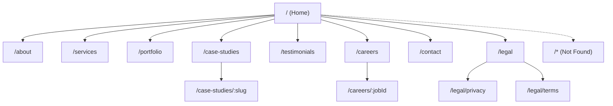

# UI/UX Design Specification — Multi-page IT Company Website

## Overview
This document defines the UI/UX system for a multi-page, IT-focused company website built with React and Vite. It captures design principles, brand-agnostic design tokens, grid and layout rules, responsive breakpoints, navigation patterns, page wireframes, component specifications, interaction states, accessibility guidelines with WCAG 2.1 AA mapping, content style and microcopy, imagery and iconography guidance, SEO/meta placement, motion guidelines, and a handoff checklist. It aligns with the existing single-page implementation and provides forward-looking guidance for the planned multi-page architecture.

The current codebase provides a single-page experience with sections (Hero, About, Services, Portfolio, Testimonials, Contact) and a neutral modern theme. This spec preserves visual foundations while extending to a multi-route site with Careers and Case Studies and adds a standardized component library and accessibility/SEO practices.

## Design Principles
- Clarity and hierarchy: Use clear headings, succinct copy, and deliberate whitespace to guide scanning. Prioritize page titles and H2/H3 structure for readability.
- Consistency and predictability: Reuse components and tokens. Navigation remains consistent across pages, with explicit state for active routes.
- Accessibility-first: Ensure keyboard navigability, visible focus, semantic landmarks, and WCAG 2.1 AA contrast. Error handling must be clear and contextual.
- Performance-minded visuals: Favor CSS/SVG and light motion. Use lazy loading and responsive assets to support fast renders on constrained devices.
- Content-first layouts: Frame content with typographic rhythm and modular grids to adapt from mobile to desktop gracefully.
- Brand-agnostic neutrality: Provide a neutral palette, scalable type, and simple shapes ready for future brand theming.

## Design Tokens
The current stylesheet defines base tokens in :root:
- --primary: #667eea
- --accent: #764ba2
- --bg: #ffffff
- --text: #2d3748
- --muted: #718096
- --surface: #f7fafc

### Semantic token model (recommended additions)
Introduce semantic tokens that map to base tokens. These can be defined in CSS as variables referencing the existing palette. This enables future brand changes without component rewrites.

- Color
  - --color-bg: var(--bg)
  - --color-surface: var(--surface)
  - --color-fg: var(--text)
  - --color-muted: var(--muted)
  - --color-accent: var(--primary)       // primary interactive color
  - --color-accent-strong: var(--accent) // gradient end or emphasis
  - --color-success: #2f855a
  - --color-danger: #c53030
  - --color-info: #319795
  - --color-focus-ring: rgba(102, 126, 234, 0.35)

- Typography
  - --font-sans: system-ui, -apple-system, "Segoe UI", Roboto, Ubuntu, "Helvetica Neue", Arial, "Noto Sans", "Liberation Sans", sans-serif
  - Type scale (clamp)
    - --text-xs: clamp(0.75rem, 0.72rem + 0.2vw, 0.8rem)
    - --text-sm: clamp(0.875rem, 0.84rem + 0.3vw, 0.95rem)
    - --text-md: clamp(1rem, 0.96rem + 0.4vw, 1.1rem)
    - --text-lg: clamp(1.125rem, 1.06rem + 0.6vw, 1.3rem)
    - --text-xl: clamp(1.25rem, 1.18rem + 0.8vw, 1.6rem)
    - --text-2xl: clamp(1.5rem, 1.36rem + 1.2vw, 2rem)
    - --text-3xl: clamp(2rem, 1.7rem + 2vw, 2.6rem)

- Spacing (4px base unit)
  - --space-1: 0.25rem
  - --space-2: 0.5rem
  - --space-3: 0.75rem
  - --space-4: 1rem
  - --space-6: 1.5rem
  - --space-8: 2rem
  - --space-12: 3rem
  - --space-16: 4rem

- Radii
  - --radius-sm: 6px
  - --radius-md: 10px
  - --radius-lg: 14px
  - --radius-xl: 20px
  - --radius-full: 999px

- Shadows/Elevation (prefer subtle)
  - --elev-1: 0 10px 24px rgba(0, 0, 0, .06)
  - --elev-2: 0 14px 32px rgba(0, 0, 0, .08)
  - --elev-3: 0 18px 36px rgba(0, 0, 0, .10)

Note: Current code already uses gradients, subtle shadows, and rounded corners consistent with these values. Add semantic tokens progressively and map component styles to them during multi-page refactor.

## Grid and Layout System
- Container: .container centers content with max-width: 1200px and 20px horizontal padding.
- Columns: Use CSS Grid with responsive auto-fit minmax patterns for cards and lists.
  - Services/Portfolio grids: repeat(auto-fit, minmax(260px, 1fr))
- Section rhythm: section padding is 64–90px depending on viewport; keep a consistent vertical rhythm to separate major sections (e.g., --space-12 to --space-16).
- Card tiles: Use article for semantic grouping with padding and hover elevation.

Recommended utilities (for optional adoption):
```css
/* Suggested utility helpers (add as needed) */
.u-container { max-width: 1200px; margin-inline: auto; padding-inline: 20px; }
.u-grid { display: grid; gap: var(--space-6); }
.u-grid-cols-1 { grid-template-columns: 1fr; }
.u-grid-auto-tiles { grid-template-columns: repeat(auto-fit, minmax(260px, 1fr)); }
.u-flex { display: flex; }
.u-flex-center { align-items: center; justify-content: center; gap: var(--space-3); }
.u-hidden-sm { display: none; } /* gated by media query */
.u-text-center { text-align: center; }
.u-mt-4 { margin-top: var(--space-4); }
.u-mb-6 { margin-bottom: var(--space-6); }
```

## Breakpoints and Responsive Rules
Adopt a min-width approach with these canonical breakpoints for layout adjustments:
- 320px: Small phones (baseline)
- 480px: Large phones
- 768px: Tablets
- 1024px: Small laptops
- 1280px+: Desktops and wide screens

Current CSS behavior:
- At ≤ 968px: two-column layouts (About, Contact) shift to single column.
- At ≤ 640px: the top navigation hides; sections reduce vertical spacing.

Extended rules (to be added progressively):
- 320–479px:
  - Single-column everywhere; increase tap targets (min 44px).
  - Hide non-critical decorations; maintain large readable text via clamp.
- 480–767px:
  - Increase card density with comfortable spacing; retain single-column for heavy text.
- 768–1023px:
  - Two-column content layouts where appropriate; 2–3 columns in grids.
- 1024–1279px:
  - Standard desktop; 3–4 columns in grids as width allows.
- 1280px+:
  - Maintain 1200px max width; avoid overly long line-lengths.

## Navigation Patterns
- Header/Topbar: Sticky at top with brand text and primary navigation. On narrow viewports, collapse or hide the long nav; provide an accessible alternative (e.g., a simplified menu or a “Menu” toggle). Ensure aria-expanded toggling and focus management when adding a menu.
- Skip Link: Include a focusable "Skip to content" link before header; target main region id.
- Active Link State: Use NavLink semantics (aria-current="page") and visible styles.
- Footer: Repeat key links and company info; include Legal (Privacy, Terms).
- Breadcrumbs: For nested routes (e.g., Case Study detail, Career detail), expose a breadcrumb trail to aid orientation.

## Information Architecture and Wireframes


### Home
- Purpose: Introduce value proposition with a Hero, then quick access to Services, Portfolio highlights, and a Careers teaser.
- Anatomy: Hero (H1, subtitle, primary CTA), Key highlights/cards, Testimonials snippet, Contact prompt.
- Mobile: Stack vertically, large type and buttons, minimal hero decoration.
- Tablet: Two-column highlights where space permits.
- Desktop: Expanded hero and multi-column card grids.

### About
- Purpose: Company mission, values, and stats.
- Anatomy: H1, mission section (text), visual/statistics grid.
- Mobile: Single column; stats stack.
- Desktop: Content and illustration side by side.

### Services
- Purpose: IT offerings list with clear titles and succinct descriptions.
- Anatomy: H1, service cards grid (icon, title, body).
- Mobile: Single-column cards with full-width tap areas.
- Desktop: 3–4 columns with hover elevation and focus styles.

### Portfolio
- Purpose: Showcase selected work.
- Anatomy: H1, project cards (image/emoji, category pill, title, short text).
- Mobile: Single column; readable summaries.
- Desktop: 3–4 columns; hover/focus elevation.

### Case Study Detail
- Purpose: Deep-dive narrative of a project.
- Anatomy: H1 (title), meta (industry), sections: Problem, Solution, Outcomes, Tech Stack; related links.
- Mobile: Linear reading flow with clear section headings.
- Desktop: Optionally a right rail for metadata.

### Testimonials
- Purpose: Build credibility with endorsements and ratings.
- Anatomy: H1, testimonial cards (quote, name, role, star rating).
- Mobile: Single-column; accessible rating labels.
- Desktop: 3 columns.

### Careers (List)
- Purpose: Present open roles with quick scan of title, type, location.
- Anatomy: H1, filter/sort (optional later), job cards with brief summary and link to detail.
- Mobile: Single-column; large tap areas.
- Desktop: 2–3 columns or single list with clear hierarchy.

### Career Detail
- Purpose: Detailed role description and apply CTA placeholder.
- Anatomy: H1 (title), meta line (type, location), sections: Responsibilities, Requirements, About Team, Apply CTA.
- Mobile: Linear flow with sticky/visible CTA near end.
- Desktop: Consider sidebar with apply CTA.

### Contact
- Purpose: Entry point for inquiries.
- Anatomy: H1, contact info (email, phone, address, socials), validated form (Name, Email, Message) with success message.
- Mobile: Sequential info then form; focus management on validation.
- Desktop: Two-column info + form.

### Legal (Privacy, Terms)
- Purpose: Provide standard legal pages.
- Anatomy: H1 with content sections; TOC (optional for long docs).
- Mobile/Desktop: Left-aligned text, adequate line-height, logical headings.

## Component Library Specifications
The following specify both existing and planned components. Items marked “(new)” are design specs to be implemented in the multi-page build.

### Header (Topbar)
- Anatomy: Brand, primary navigation, optional menu toggle on small screens.
- Behavior: Sticky; nav links highlight on hover/focus and active route.
- Accessibility: Include skip link; if a mobile menu is added, ensure aria-expanded, focus trap inside menu, Esc to close.

### Footer
- Anatomy: Company info, repeated key links, legal links.
- Accessibility: Semantically a footer landmark; links are keyboard-accessible.

### Hero
- Anatomy: H1 title, subtitle, primary CTA.
- States: CTA hover/focus elevation; respect prefers-reduced-motion for decorative animations.
- Accessibility: Ensure color contrast for text over gradient; CTA is a button or link with clear purpose.

### Cards (Service/Portfolio/Case Study/Job)
- Anatomy: Container, icon/image, title, description, optional tags.
- Variants: Standard, featured (slightly elevated).
- States: Hover/focus elevation; outline focus-visible.
- Accessibility: Use article; ensure whole card or explicit link is focusable. Avoid duplicating links.

### Buttons
- Variants: Primary (solid accent), Secondary (surface with border), Ghost (text + subtle bg hover).
- Sizes: md, lg.
- States: hover, focus-visible ring, active press, disabled (reduced opacity, no pointer events), loading (spinner/icon and aria-busy).
- Accessibility: Role=button on non-native elements; aria-disabled when disabled; maintain 4.5:1 contrast minimum for text.

### Inputs and Forms
- Anatomy: Label, input/textarea, hint, error text.
- States: default, focus (accent border and ring), error (danger border and message), disabled (dimmed), success (optional).
- Validation: Client-side validation with clear messages next to fields; announce via aria-live polite region.
- Accessibility: Use label with htmlFor; associate error with aria-describedby; input types (email) and attributes (required).

### Tabs (new)
- Anatomy: Tablist with tabs and panels.
- Behavior: Click or arrow keys to navigate; active tab has aria-selected and focus.
- Accessibility: role="tablist"/"tab"/"tabpanel"; keyboard support per WAI-ARIA Authoring Practices.

### Accordions (new)
- Anatomy: Headers as buttons toggling content regions.
- Behavior: Expand/collapse with smooth motion; only one open (optional).
- Accessibility: aria-expanded, aria-controls, id pairing; focus remains on header.

### Modals (new)
- Anatomy: Overlay, dialog, title, body, close button.
- Behavior: Open via trigger; focus trap inside; close via Esc or close button; restore focus to trigger.
- Accessibility: role="dialog" or aria-modal="true"; labeled by title id.

### Toasts (new)
- Anatomy: Small notification with icon, message, close.
- Behavior: Non-blocking, auto-dismiss after timeout, pause on hover/focus.
- Accessibility: Use aria-live="polite" for success/info; "assertive" sparingly for errors.

### Pagination (new)
- Anatomy: Container with Prev, page numbers, Next.
- Behavior: Disable Prev/Next at edges; show current page state.
- Accessibility: nav with aria-label="Pagination"; aria-current="page" on active.

### Breadcrumbs (new)
- Anatomy: List of links to ancestors.
- Behavior: Truncate middle items on narrow screens.
- Accessibility: nav with aria-label="Breadcrumb"; last item not a link; separators hidden from screen readers.

## Interaction States
- Hover: Elevate cards and buttons subtly (transform: translateY(-2–6px); shadow increases one step).
- Focus: Use :focus-visible with a 2–3px ring (e.g., box-shadow: 0 0 0 3px var(--color-focus-ring)).
- Disabled: Reduce opacity to ~60%; remove pointer events; ensure disabled labels remain readable.
- Loading: Use a spinner or animated dots; disable interactions; add aria-busy="true".
- Error: Red border and message in --color-danger; associate with the field using aria-describedby.

## Accessibility Guidelines (WCAG 2.1 AA Mapping)
- 1.3.1 Info and Relationships: Semantic landmarks (header, nav, main, footer), headings with sensible hierarchy (one H1 per page).
- 1.3.2 Meaningful Sequence: DOM order matches visual order; tab order follows document flow.
- 1.4.1 Use of Color: Never rely on color alone; use icons/text for statuses.
- 1.4.3 Contrast (Minimum): Text and key UI ≥ 4.5:1; large text ≥ 3:1. Validate gradients and overlays behind text.
- 1.4.10 Reflow: Layouts reflow at 320px without loss of content or functionality.
- 2.1.1 Keyboard: All interactive components operable via keyboard without traps.
- 2.1.2 No Keyboard Trap: Ensure modals/menus manage focus and allow escape.
- 2.4.1 Bypass Blocks: Provide a “Skip to content” link targeting main.
- 2.4.3 Focus Order: Logical focus progression matching reading order.
- 2.4.4 Link Purpose: Link text is descriptive; avoid ambiguous “Click here.”
- 2.4.7 Focus Visible: Obvious focus indicator for all interactive elements.
- 3.2.2 On Input: Changing form values does not trigger unexpected context changes.
- 3.3.1 Error Identification: Clearly identify input errors near fields.
- 3.3.2 Labels or Instructions: Every input has a label and clear instructions.
- 4.1.2 Name, Role, Value: Expose accessible names and roles; update aria-* as state changes.

## Content Guidelines and Sample Microcopy
- Tone: Professional, concise, and approachable for IT stakeholders (CIO/CTO, EMs, candidates).
- Headings: One H1 per page; use H2/H3 to segment content; keep titles action-oriented and specific.
- CTAs:
  - Primary: “Get Started”, “Contact Us”, “Explore Services”
  - Secondary: “View Portfolio”, “See Open Roles”, “Read the Case Study”
- Form microcopy:
  - Field hints: “We’ll use your email to get back to you.”
  - Error messages: “Enter a valid email.” “Name is required.” “Message must be at least 10 characters.”
  - Success: “Message sent! We’ll get back to you soon.”
- Careers:
  - Teaser: “Build the future with us.”
  - List empty state: “No open roles at this time. Check back soon.”
- Case Studies:
  - Section headers: “Problem”, “Solution”, “Outcomes”, “Tech Stack”

## Imagery and Iconography Guidance
- Placeholders: Emojis are acceptable as placeholders in the prototype. Prefer to move to inline SVG or optimized images for production.
- Style: Minimalist, technology-oriented line icons; avoid overly decorative imagery that reduces contrast.
- Accessibility: Provide descriptive alt text for informative images. Presentational graphics should have aria-hidden="true" and empty alt.
- Performance: Use vector where possible; lazy-load non-critical imagery below the fold.

## SEO and Meta Placement
- Titles and Meta: Each route sets a unique document.title and meta description via a simple utility (e.g., setMeta). Home, Services, Portfolio, and Careers also set Open Graph tags (og:title, og:description, og:type, og:image if available).
- URL design: Human-readable slugs for case studies (e.g., /case-studies/banking-portal-modernization); IDs or slugs for careers (e.g., /careers/fe-001).
- Social: Ensure card titles/descriptions are concise and reflect primary value.
- Robots/Sitemap: Provide static robots.txt and sitemap.xml placeholders at deployment.
- Index.html fallback: Keep a sensible default title/description for the base document to support initial load before client routing.

## Motion and Interaction Guidelines
- Motion purpose: Reinforce hierarchy and feedback (hover lift, focus ring), not distract.
- Durations and easing:
  - Hover/focus: 120–200ms ease-out
  - Expand/collapse (accordion): 150–250ms ease-in-out
  - Modal open/close: 150–220ms ease
- Reduced motion: Respect prefers-reduced-motion; disable decorative animations (e.g., hero floating elements) and substitute with static visuals.
- Performance: Avoid animating expensive properties like width; prefer transform and opacity.

## CSS Utility Examples (Optional Adoption)
These examples can coexist with current styles to accelerate uniformity. Introduce gradually.
```css
/* Spacing and layout */
.u-px-4 { padding-inline: var(--space-4); }
.u-py-6 { padding-block: var(--space-6); }
.u-mx-auto { margin-inline: auto; }
.u-w-full { width: 100%; }

/* Typography */
.u-text-sm { font-size: var(--text-sm); }
.u-text-md { font-size: var(--text-md); }
.u-text-lg { font-size: var(--text-lg); }
.u-font-bold { font-weight: 700; }
.u-text-muted { color: var(--color-muted); }

/* Surface and borders */
.u-surface { background: var(--color-surface); border-radius: var(--radius-lg); box-shadow: var(--elev-1); }
.u-border { border: 1px solid #e2e8f0; border-radius: var(--radius-md); }

/* Interactive */
.u-btn {
  display: inline-flex; align-items: center; justify-content: center;
  padding: 0.7rem 1.2rem; border-radius: var(--radius-full); font-weight: 700;
  transition: transform .2s ease, box-shadow .2s ease;
}
.u-btn-primary { background: linear-gradient(135deg, var(--color-accent), var(--color-accent-strong)); color: #fff; }
.u-btn-primary:hover { transform: translateY(-2px); box-shadow: var(--elev-3); }
.u-btn-secondary { background: var(--color-surface); color: var(--color-fg); border: 1px solid #e2e8f0; }
.u-btn-secondary:hover { box-shadow: var(--elev-2); }
.u-focus-ring { box-shadow: 0 0 0 3px var(--color-focus-ring); outline: none; }
```

## Mobile, Tablet, and Desktop Annotations
- Mobile (≤ 480px):
  - Single-column layouts; increase base size of touch targets; hide non-essential nav items; ensure CTA visibility.
- Tablet (768–1023px):
  - Two-column layouts for About/Contact; 2–3 columns in grids; show fuller navigation if space allows.
- Desktop (≥ 1024px):
  - Multi-column grids (3–4); maintain max content width for optimal line length; sticky header with full nav.

## Implementation Handoff Checklist
- Tokens
  - Add semantic tokens (color, spacing, radii, shadows, type scale); map existing styles to these progressively.
- Layout
  - Ensure container widths and section paddings follow spec; verify grid templates for cards.
- Routing
  - Introduce React Router with routes for Home, About, Services, Portfolio, Case Studies (list + detail), Testimonials, Careers (list + detail), Contact, and Legal pages.
- Navigation
  - Implement skip link; active link states with aria-current; responsive menu behavior with full keyboard support.
- Components
  - Align existing Hero, Cards, Buttons, Inputs with specs; add Tabs, Accordions, Modals, Toasts, Pagination, Breadcrumbs as needed by pages.
- Accessibility
  - Validate focus-visible styles; labels and errors on forms; aria-live for form status; contrast AA across themes.
- Content
  - Apply microcopy patterns; confirm headings hierarchy across pages; ensure consistent tone and clarity.
- SEO
  - Set per-route title and meta; add Open Graph tags for key pages; include robots.txt and sitemap.xml placeholders.
- Motion
  - Add transitions within specified durations; respect prefers-reduced-motion.
- QA
  - Test at 320, 480, 768, 1024, 1280+ widths; keyboard-only navigation; screen reader spot checks; Lighthouse performance and accessibility targets.

## References to Current Implementation
- Color tokens and gradients: Present in src/styles.css and used in Hero, Cards, Buttons with hover/focus states and shadows consistent with this spec.
- Sticky topbar and nav: Implemented in App.jsx and styles.css; nav is hidden at ≤ 640px, consistent with responsive guidelines.
- Grids: Services and Portfolio use CSS Grid with repeat(auto-fit, minmax(260px, 1fr)), aligning to the grid guidance.
- Forms: Contact form provides client-side validation and success state with contextual error messages near inputs.

## Future Extensions
- Dark mode tokens and contrast validation.
- Theming API for brand overrides.
- Component documentation site (Storybook or similar) to showcase interactive states and accessibility notes.
